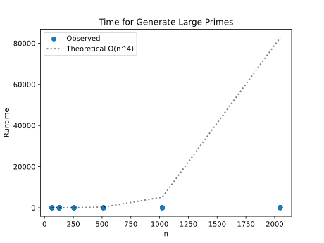
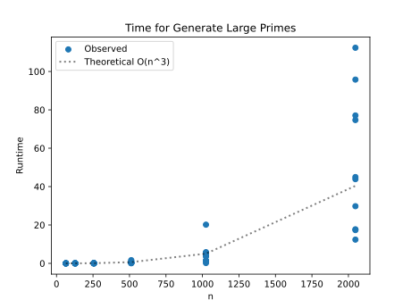
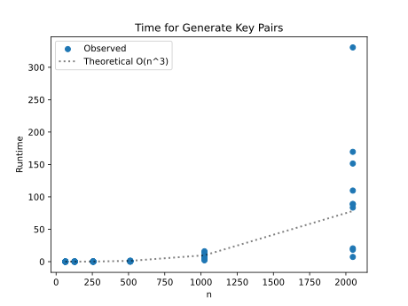
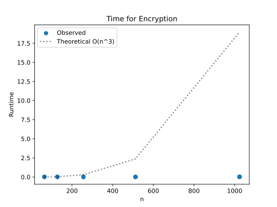
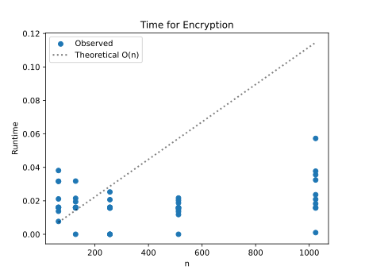
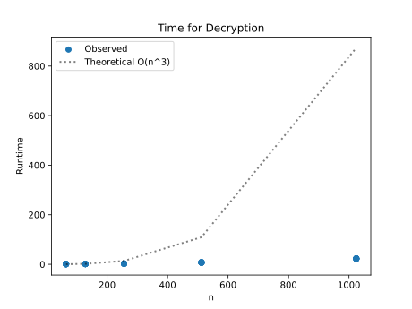
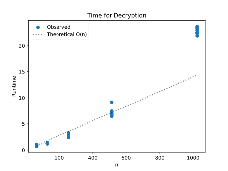

# Project Report - RSA and Primality Tests

## Baseline

### Design Experience

My partner was my classmate Caleb Dougal. We explained to each other our interpretation of the Baseline requirements and then shared the algorithms we discussed in class that we would need. Then we wrote them down as pseudo code to make sure we understood them.

### Theoretical Analysis - Prime Number Generation

#### Time 

```py
def mod_exp(x: int, y: int, N: int) -> int:             # O(n^3) - Overall complexity
    if y == 0:                                          # O(1) - comparison is constant
        return 1                                        # O(1) - returning is constant
    z = mod_exp(x, y // 2, N)                           # O(n) - this recursively calls itself O(n) times
    if y % 2 == 0:                                      # O(n^2) - mod operations are O(n^2) and comparison is constant
        return (z * z) % N                              # O(n^2) - multiplication operations are O(n^2) and returning is constant
    else:
        return (x * z * z) % N                          # O(n^2) - multiplication operations are O(n^2) and returning is constant
```

The highest cost in the function is O(n^2), but it is repeated n times, resulting in **O(n^3)** overall.

```py
def fermat(N: int, k: int) -> bool:                             # O(n^3) - Overall complexity
    """
    Returns True if N is prime
    """
    for i in range(0, k):                                       # O(k) - the loop is run k times
        if (mod_exp(random.randint(1,N-1), N-1, N) % N != 1):   # O(n^3) - mod_exp has O(n^3)
            return False                                        # O(1) - returning is constant
    return True                                                 # O(1) - returning is constant
```

The highest cost in the function is O(n^3), but it is repeated constant k times, resulting in **O(n^3)** overall.

```py
def miller_rabin(N: int, k: int) -> bool:               # O(n^4) - Overall complexity
    """
    Returns True if N is prime
    """

    u = N-1
    t = 0
    while u % 2 == 0:
        u //= 2
        t += 1

    if N < 2:
        return False
    if N in (2, 3):
        return True
    if N % 2 == 0:                                      # O(n^2) - mod operations are O(n^2) and comparison is constant
        return False

    for _ in range(k):                                  # O(k) - the loop is run k times
        a = random.randint(2, N - 2)                    # O(n) - python's getrandbits has complexity of O(n)

        current = mod_exp(a, u, N)                      # O(n^3) - mod_exp has O(n^3)

        if current == 1 or current == N - 1:
            continue

        for _ in range(t - 1):                          # O(n) - this loop will run n/2 times
            current = mod_exp(current, 2, N)            # O(n^3) - mod_exp has O(n^3)
            if current == N - 1:
                break
        else:
            return False

    return True
```

This will loop about n times, performing a O(n^3) operation everytime, resulting in **O(n^4)** time complexity.

```py
def generate_large_prime(n_bits: int) -> int:           # O(n^4) - Overall complexity
    """Generate a random prime number with the specified bit length"""
    prime: bool = False
    bits: int
    k = 20
    while not prime:                                    # O(n) - this will loop on average O(n) times
        bits =  random.getrandbits(n_bits)              # O(n) - python's getrandbits has complexity of O(n)
        prime = fermat(bits, k)                         # O(n^3) - fermat has O(n^3) complexity
    return bits
```

This will loop about n times, performing a O(n^3) operation everytime, resulting in **O(n^4)** time complexity.

#### Space

```py
def mod_exp(x: int, y: int, N: int) -> int:             # O(n^2) - Overall complexity
    if y == 0:                                          # O(n) - y is of size n
        return 1                                        
    z = mod_exp(x, y // 2, N)                           # O(n) - operations are of the order of n
    if y % 2 == 0:                                      # O(n) - operations are of the order of n
        return (z * z) % N                              # O(n) - operations are of the order of n
    else:
        return (x * z * z) % N                          # O(n) - operations are of the order of n
```

The highest cost in the function is O(n), but it is repeated n times, resulting in **O(n^2)** overall.

```py
def fermat(N: int, k: int) -> bool:                             # O(n^2) - Overall complexity
    """
    Returns True if N is prime
    """
    for i in range(0, k):                                       # O(n) - k is of size n
        if (mod_exp(random.randint(1,N-1), N-1, N) % N != 1):   # O(n^3) - mod_exp has O(n^2)
            return False                                        
    return True                                                 
```

The highest cost in the function is O(n^2), but it is repeated constant n times, resulting in **O(n^3)** overall.

```py
def miller_rabin(N: int, k: int) -> bool:               # O(n^3) - Overall complexity
    """
    Returns True if N is prime
    """

    u = N-1
    t = 0
    while u % 2 == 0:
        u //= 2
        t += 1

    if N < 2:
        return False
    if N in (2, 3):
        return True
    if N % 2 == 0:                                      # O(n) - operations are of the order of n
        return False

    for _ in range(k):                                  # O(k) - k is of size n
        a = random.randint(2, N - 2)                    # O(n) - a is of size n

        current = mod_exp(a, u, N)                      # O(n^2) - mod_exp has O(n^2)

        if current == 1 or current == N - 1:
            continue

        for _ in range(t - 1):                          # O(n) - t is of size n
            current = mod_exp(current, 2, N)            # O(n^2) - mod_exp has O(n^2)
            if current == N - 1:
                break
        else:
            return False

    return True
```

This will loop O(n) times, costing O(n^2) everytime, resulting in **O(n^3)** space complexity.

```py
def generate_large_prime(n_bits: int) -> int:           # O(n^4) - Overall complexity
    """Generate a random prime number with the specified bit length"""
    prime: bool = False
    bits: int
    k = 20
    while not prime:                                    # O(n) - this will loop on average n times
        bits =  random.getrandbits(n_bits)              # O(n) - bits is of size n
        prime = fermat(bits, k)                         # O(n^3) - fermat has O(n^3) complexity
    return bits
```

This will loop about n times, costing O(n^3) everytime, resulting in **O(n^4)** space complexity.

### Empirical Data

| N    | time (sec) |
|------|------------|
| 64   |   0.001    |
| 128  |   0.012    |
| 256  |   0.056    |
| 512  |   0.496    |
| 1024 |   5.031    |
| 2048 |   52.595   |

### Comparison of Theoretical and Empirical Results

- Theoretical order of growth: **O(n^4)**
- Empirical order of growth (if different from theoretical): **O(n^3)**



The expected analysis does not match the theoretical analysis.

My theoretical order of growth for generate_large_prime() (O(n^4)) was based on my assumption that my fermat() function was O(n^3) and was repeated n times. However, I was wrong because the while loop in generate_large_prime() is run less than n times and is not dependent on the input, resulting in generate_large_prime() having **O(n^3)** complexity.



## Core

### Design Experience

My partner was my classmate Caleb Dougal. We explained to each other our interpretation of the Core requirements and then shared the algorithms we discussed in class that we would need. Then we wrote them down as pseudo code to make sure we understood them.

### Theoretical Analysis - Key Pair Generation

#### Time 

```py
def extEuclid(a:int, b:int) -> tuple[int, int, int]:       # O(n^3) - Overall complexity
    if b == 0:
        return 1, 0, a
    x,y,z = extEuclid(b, a % b)                            # O(n) - this will call recursively about n times
    return y, (x - (a // b) * y), z                        # O(n^2) - multiplication has O(n^2) complexity
```

This has an overall complexity of **O(n^3)** as it performs a O(n^2) oporation n times.

```py
def generate_key_pairs(n_bits) -> tuple[int, int, int]:    # O(n^3) - Overall complexity
    """
    Generate RSA public and private key pairs.
    Randomly creates a p and q (two large n-bit primes)
    Computes N = p*q
    Computes e and d such that e*d = 1 mod (p-1)(q-1)
    Return N, e, and d
    """

    p = generate_large_prime(n_bits)                       # O(n^3) - generate_large_prime has O(n^3) complexity
    q = generate_large_prime(n_bits)                       # O(n^3) - generate_large_prime has O(n^3) complexity
    N:int = p*q                                            # O(n^2) - multiplication has O(n^2) complexity
    e:int
    d:int

    for i in range(0, 24):                                 # O(24) - this loop is run 24 times
        e = primes[i]
        x,y,z = extEuclid((p-1)*(q-1), e)                  # O(n^3) - extEuclid has O(n^3) complexity
        if z == 1:
            d = y % ((p-1)*(q-1))                          # O(n^2) - extEuclid has O(n^3) complexity
            break    
    return N, e, d
```

This function has **O(n^3)** as the highest costing operation is O(n^3).

#### Space

```py
def extEuclid(a:int, b:int) -> tuple[int, int, int]:       # O(n^2) - Overall complexity
    if b == 0:                                             # O(n) - operations are of the order of n
        return 1, 0, a
    x,y,z = extEuclid(b, a % b)                            # O(n) - operations are of the order of n
    return y, (x - (a // b) * y), z                        # O(n) - operations are of the order of n
```

This will loop about n times, costing O(n) everytime, resulting in **O(n^2)** space complexity.

```py
def generate_key_pairs(n_bits) -> tuple[int, int, int]:    # O(n^4) - Overall complexity
    """
    Generate RSA public and private key pairs.
    Randomly creates a p and q (two large n-bit primes)
    Computes N = p*q
    Computes e and d such that e*d = 1 mod (p-1)(q-1)
    Return N, e, and d
    """

    p = generate_large_prime(n_bits)                       # O(n^4) - generate_large_prime has O(n^4) complexity
    q = generate_large_prime(n_bits)                       # O(n^4) - generate_large_prime has O(n^4) complexity
    N:int = p*q                                            # O(n) - N is of size n
    e:int                                                  # O(n) - e is of size n
    d:int                                                  # O(n) - d is of size n

    for i in range(0, 24):
        e = primes[i]
        x,y,z = extEuclid((p-1)*(q-1), e)                  # O(n^2) - extEuclid has O(n^2) complexity
        if z == 1:
            d = y % ((p-1)*(q-1))                          # O(n) - operations are of the order of n
            break    
    return N, e, d
```

This has **O(n^4)** space complexity as the highest costing operation is O(n^4).

### Empirical Data

| N    | time (sec) |
|------|------------|
| 64   |   0.004    |
| 128  |   0.018    |
| 256  |   0.105    |
| 512  |   0.663    |
| 1024 |   7.399    |
| 2048 |   106.834  |

### Comparison of Theoretical and Empirical Results

- Theoretical order of growth: **O(n^3)** 
- Empirical order of growth (if different from theoretical):



The theoretical order of growth matches the empirical order of growth.

## Stretch 1

### Design Experience

My partner was my classmate Caleb Dougal. We reviewed the files given to us and determined which ones we needed to use to encrypt and decrypt each other's messages. We also explained that we needed to encrypt uses each other's public key and the decrypt each other's message with our own private key.

### Theoretical Analysis - Encrypt and Decrypt

#### Time 

```py
def transform(                                                     # O(n^3) - Overall complexity
        data: bytes,
        N: int,
        exponent: int,
        in_chunk_bytes: int,
        out_chunk_bytes: int,
) -> bytes:
    out = []
    # If there are M bytes in the file,
    # how many chunks are created,
    # and how big are those chunks in terms of n_bits?
    for block in chunks(data, in_chunk_bytes):                     # O(constant) - iterates constant times
        if len(block) != in_chunk_bytes:
            raise ValueError("Input not aligned to chunk size.")
        x = int.from_bytes(block, "big")                           # O(n)
        y = mod_exp(x, exponent, N)                                # O(n^3) - mod_exp has O(n^3)
        out.append(y.to_bytes(out_chunk_bytes, "big"))             # O(n)
    return b"".join(out)                                           # O(n)
```

This has an overall complexity of **O(n^3)** as the highest cost is O(n^3).

#### Space

```py
def transform(                                                     # O(n^3) - Overall complexity
        data: bytes,
        N: int,
        exponent: int,
        in_chunk_bytes: int,
        out_chunk_bytes: int,
) -> bytes:
    out = []
    # If there are M bytes in the file,
    # how many chunks are created,
    # and how big are those chunks in terms of n_bits?
    for block in chunks(data, in_chunk_bytes):                     # O(n) - dependant on n
        if len(block) != in_chunk_bytes:
            raise ValueError("Input not aligned to chunk size.")
        x = int.from_bytes(block, "big")                           # O(n) - operations are of order n
        y = mod_exp(x, exponent, N)                                # O(n^2) - mod_exp has O(n^2)
        out.append(y.to_bytes(out_chunk_bytes, "big"))             # O(n) - operations are of order n
    return b"".join(out)                                           # O(n) - operations are of order n
```

This has an overall complexity of **O(n^3)** as the highest cost is O(n^2) repeated O(n) times.

### Empirical Data

| N    | encryption time (sec) | decryption time (sec) |
|------|-----------------------|-----------------------|
| 64   |        0.021          |         0.846         |
| 128  |        0.017          |         1.265         |
| 256  |        0.013          |         2.718         |
| 512  |        0.015          |         7.171         |
| 1024 |        0.026          |         22.814        |
| 2048 |          X            |           X           |

### Comparison of Theoretical and Empirical Results

#### Encryption

- Theoretical order of growth: **O(n^3)**
- Empirical order of growth (if different from theoretical): **O(n)**



The expected analysis does not match the theoretical analysis.

My theoretical order of growth for transform() (O(n^3)) may not be accurate because my machine could not compute all of the data. Since it is missing all the 2048 data, the graphs may seem very different, especially considering how much of an effect this data has on the outcome.



#### Decryption

- Theoretical order of growth: **O(n^3)** 
- Empirical order of growth (if different from theoretical): **O(n)** 



The expected analysis does not match the theoretical analysis.

My theoretical order of growth for transform() (O(n^3)) may not be accurate because my machine could not compute all of the data. Since it is missing all the 2048 data, the graphs may seem very different, especially considering how much of an effect this data has on the outcome.



### Encrypting and Decrypting With A Classmate

My partner was Caleb Dougal. Initially, he was able to successfully decrypt my message to him. When I decrypted his message to me, it was still nonsence. He encrypted his message again and sent it to me, and this time when I decrypted his message, I successfully received it.

## Stretch 2

### Design Experience

My partner was my classmate Caleb Dougal. It took us a while to understand the Miller-Rabin algorithm, but we eventually understood it enough to write down pseudo code for it. We had to revise our pseudo code a few times before we were satisfied.

### Probabilistic Natures of Fermat and Miller Rabin

### Results

I ran each of the following values of N 30 times and recorded the number of false positives that each function returned for the given k.

| N     | k  | F | MR | 
|-------|----|---|----|
| 561   | 20 | 0 | 0  |
| 2821  | 20 | 1 | 0  |
| 29341 | 20 | 2 | 0  |
| 48881 | 20 | 7 | 0  |
| 29341 | 50 | 0 | 0  |
| 48881 | 50 | 3 | 0  |

### Discussion

For smaller numbers, Fermat was very accurate most of the time. As N increased, and k was smaller, Fermat became less accurate, but still had, in worst case scenario, about a 76% chance of being correct. As k increased, Fermat became more accurate.

From my results, the Miller-Rabin function was correct every time, regardless of N or k.

## Project Review

I met with Mr. Caleb Dougal. Even though we planned together, we discussed how we implemented each function (specifically Miller-Rabin), compared time and space complexities, discussed our coefficients, and shared difficulties that we encountered.

We implemented most of our functions the same, as a result of planning together. Our biggest difference was in our Miller-Rabin function since I modified mine from the pseudo code we generated.

We had some differences in our time complexities because I miss calculated the complexity of generate_large_prime. Our space complexities were fairly similar.

Caleb's runtimes were slightly faster than mine at smaller n's but the gap grew as n increased. This may be a result of his machine being faster than mine in general.

We both had very skewed data for encrypting and decrypting. We think this is because our machines failed to complete the data for n size 2048, which would heavily impact the data.

